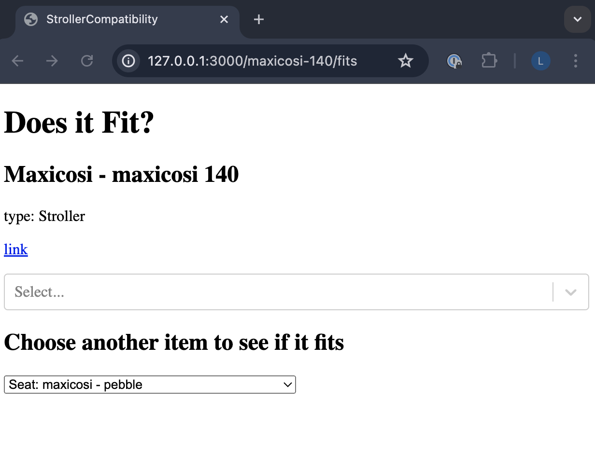
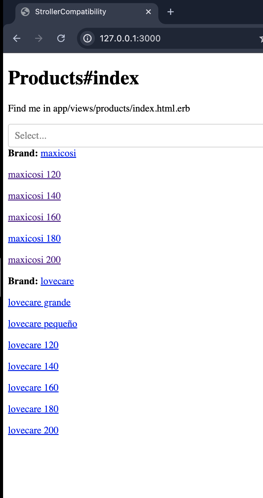
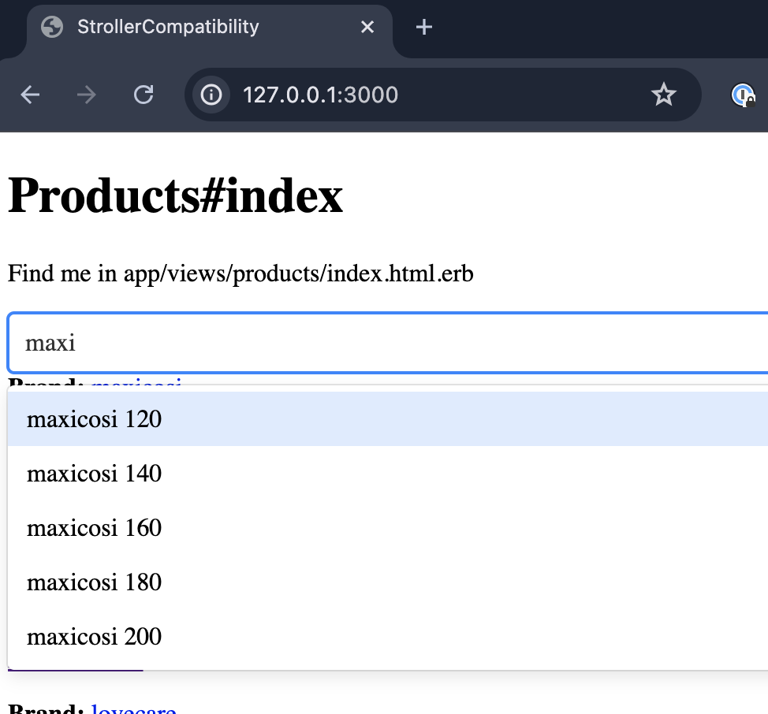

# Dev Log

## 27-07-2024

### Quick Intro

So, I thought I'd do a quick recap of what this project is about.

I'm a new dad, and as a new dad, I have basically no other personality. I just obsess over baby stuff and try to bring it up in conversation as often as possible.

One of the things I obsess over is prams, or as the americans say, strollers. Turns out they're bloody expensive, and they're sold as packs of strollers, seats, bassinets, in various combinations. Some fit together, some don't (even in the same brand!), and some require adapters. Figuring out which fit and which don't means scowering amazon reviews and ferousious googling.

So, I thought I'd make this little webapp to be able to figure it out in a few clicks. You type in your stoller, type in the car seat / bassinet / whatever and it will say a) it fits, b) you need an adapter or c) sorry, no luck. Also, it would tell you which products would fit your stroller! Pretty sweet, right?!

I thought this project would be the perfect opportunity to learn RoR, and by some miracle I currently have an hour or two in the morning to work on it.

The basic plan is the following:
1. build a simple app
2. build the database
3. market
4. profit

#### 1. build a simple app

I'm using RoR with a postgres (supabase) backend hosted on fly.io. The frontend will be minimal using mainly ror views and some react components sprinkled in. The first part of this dev log will be focused on this. 

This is a hobby project, so I have to be pretty cutthroat about what I choose to build.

#### 2. build the database

This can be manually populated at first from a few good sources. 

After this, I have a few ideas:
- crowdsource: add a form for users to add if they think a product is compatible
- scraping: scrape amazon reviews and brand websites for keywords, manually review to confirm compatibilites
- scraping + ai: use some off the shelf ai apis to enhance the scraping

#### 3. market

Not my strong suit, but the basic idea is to SEO this with very specific combinatorial URLs. Think 'www.strollercompatibility.com/does-maxicosi-stroller-fit-lovecare-pebble-car-seat'. I don't know how that works with seo, but I'm hoping it will give enough of a boost that I don't need to do much else. We'll see.

#### 4. profit

Affiliate sales from product links. Again, I don't know anything about this, but that's my basic plan. We'll see. If this actually makes a profit that would be awesome.

### First Week: Build the basic app

So far:
- built a simple rails app. Learnt a lot, rails is fun but has a lot of implicit knowledge required. Able to get up and running crazy fast though.
- deployed and setup database. Fly.io and supabase are amazing tools. 
- Iterated a bit on the data model. In the end I've gone with a generic product table instead of different tables for each product type. This is because I mostly need to query against the set of all products. I've added a polymorphic type relationship for product specific attributes. Time will tell here.
- There are still some inefficient queries there, but I don't care about that yet. I'll optimise for that when I need to.
- I decided on server side filtering. It was possible to load all the products to the browser and filter client side. Easier and faster initially but it would have been a pain once product list grows. IMO best to avoid early, and not too hard to sort out from the start.
- Added react. Serving react through the RoR asset pipeline, which seems a bit cumbersome but for my purposes (only a few components) this seems right. 

Next up:
- UI. I'd prefer to have this already so I can deliver early, but it's still on the todo pile. That's next on my list.
- After that, on to the db population work...

