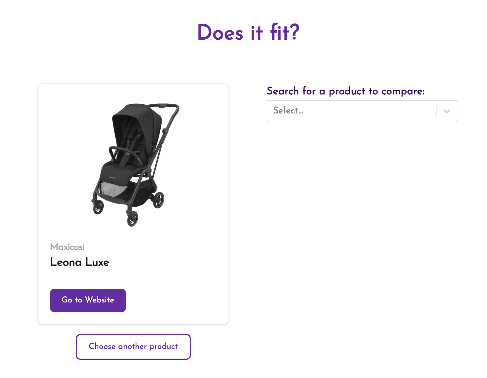
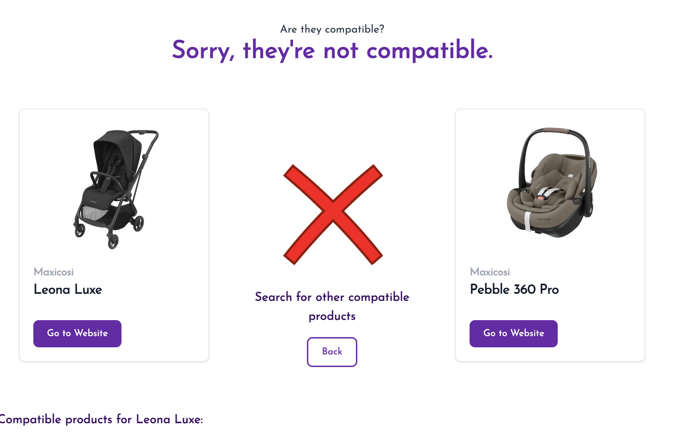
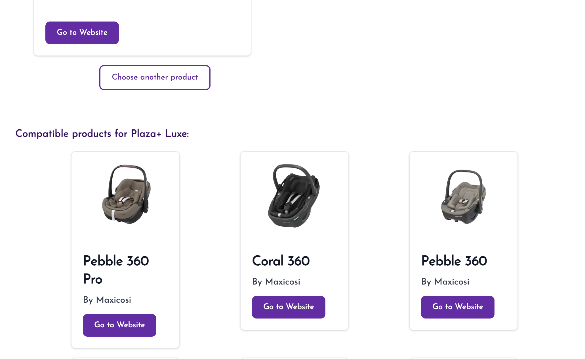
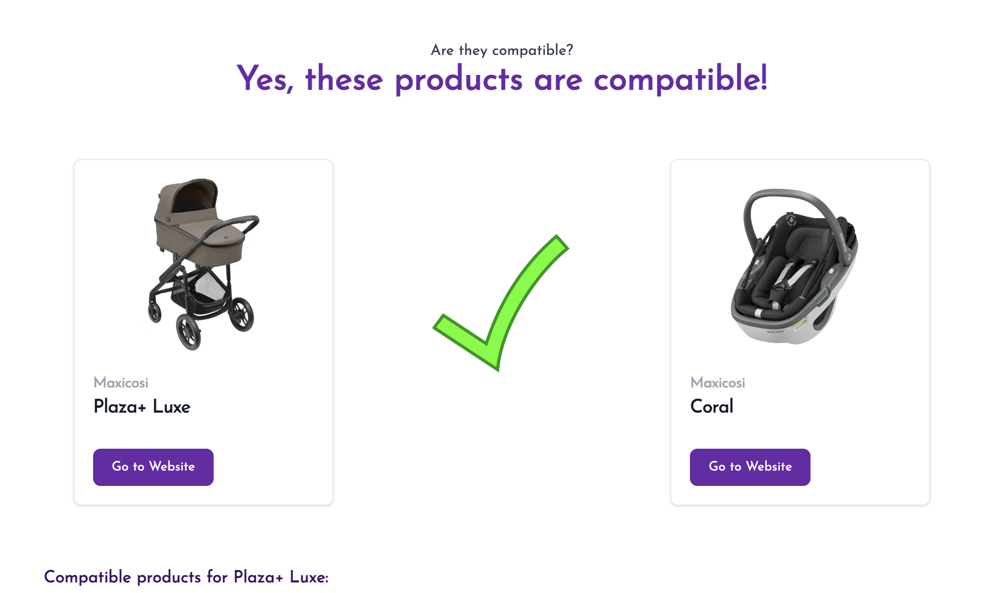
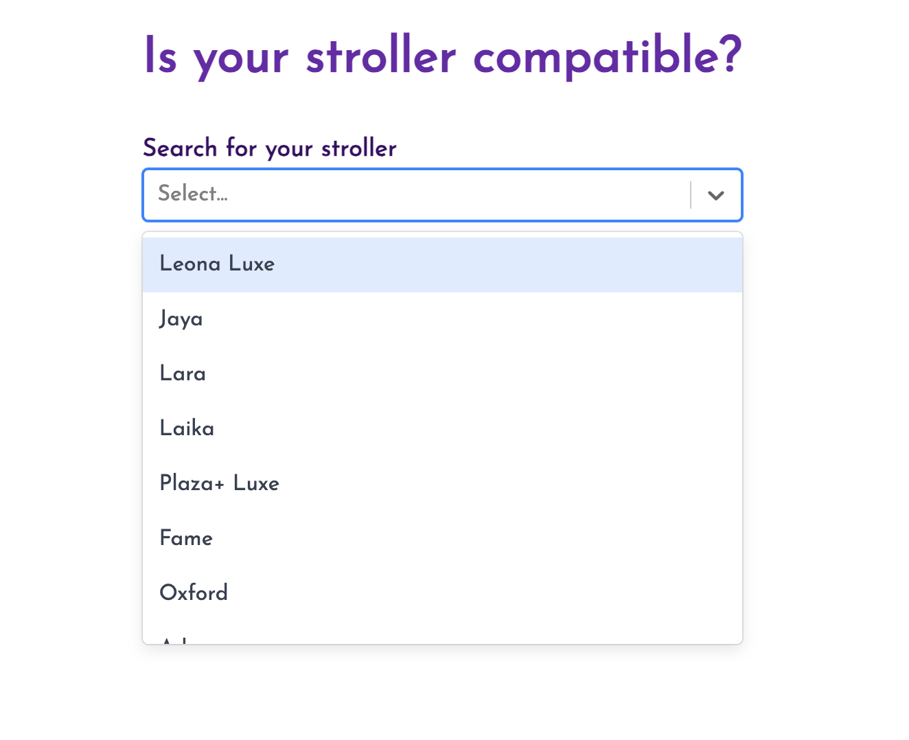
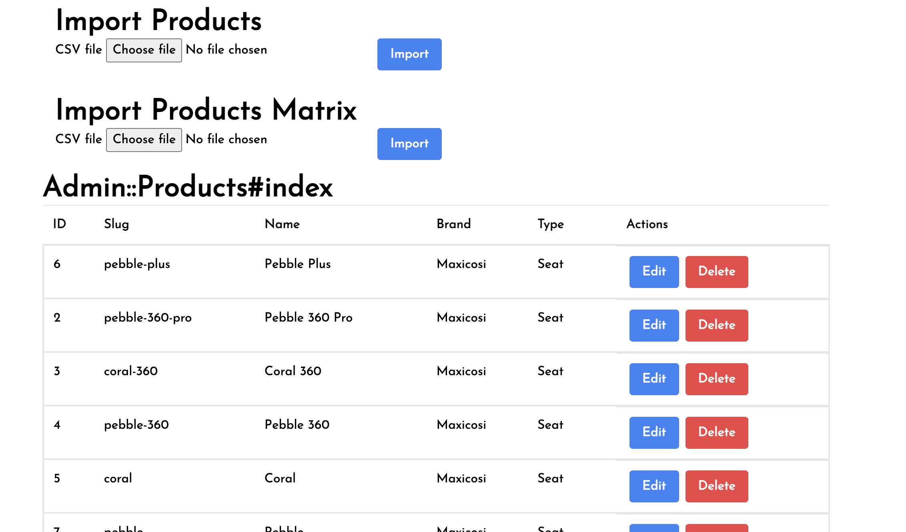
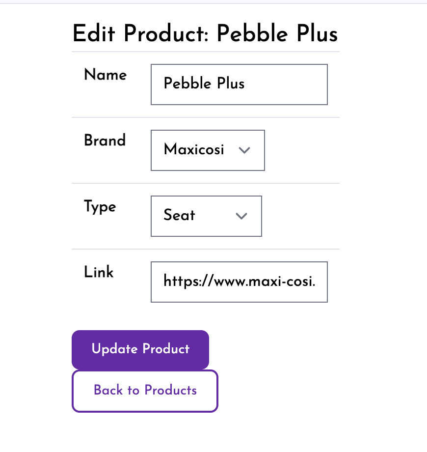
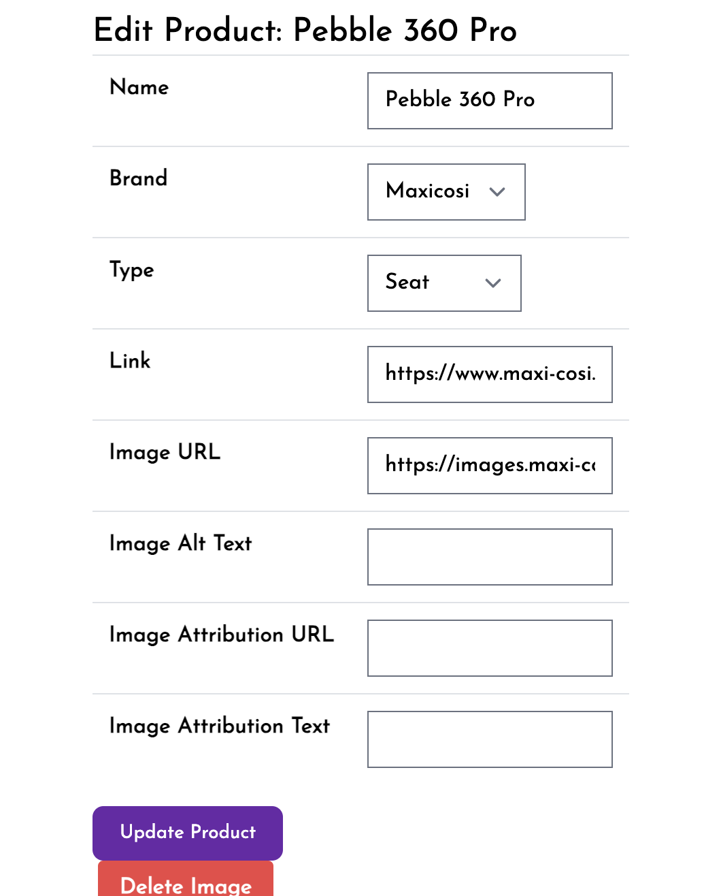

# Dev Log

## 02-08-2024

### Starting to look like a real thing

Ok, so, I didn't have as much time as I'd have liked this week, but it's not been too bad. Here's what I got done this week.

- UI now looks half decent
- Added an admin section for uploading and editing product data
- Added csv import functionality
- Manually populated from one of the targeted data sources

#### Pretty UI

I didn't spend long getting the design to look right, but I think it has the basics now. 

Here are a few snaps:

Still a lot to improve;
- variable image sizes are a mess
- the footer image carousel needs work
- I don't like the cross/check icons
- not responsive

However, with such limited time I have to be cut-throat in what I work on - these aren't priority.

#### Admin

This is laying groundwork for populating the db. I'm going to need a quick way to edit data, so I'm using two approaches;
1. simple admin interface for quick edits
2. csv import for bulk uploads

The admin UI is pretty boilerplate. Here's what it looks like so far:

#### CSVs

I created two methods of uploading csvs;
1. upload a list of product data
2. upload a matrix of products for compatibility

The list of products is self explanatory.

The matrix of products is to bulk upload compatability data. I.e. these two products are compatible.

It might be easier to upload a csv where each row is a link, same as the sql, but we'll burn that brige when we come to it.

#### First Data

Manually uploaded some official brand data to kick us off. Not scalable, but fine for now.

Still hotloading images from brand websites, not good but will be ok for now afaik.

## Next up...

- I've neglected deployment this week, so will make sure everything's ship shape there.
- more easy sources of data I can upload
- start looking into a more scalable way of populating the db
- It's getting close to the point of minimum usefulness, so have to be careful not to fall into the trap of shipping-procrastination. Gotta put it out there!
- Need a name and a domain... no idea what yet.

