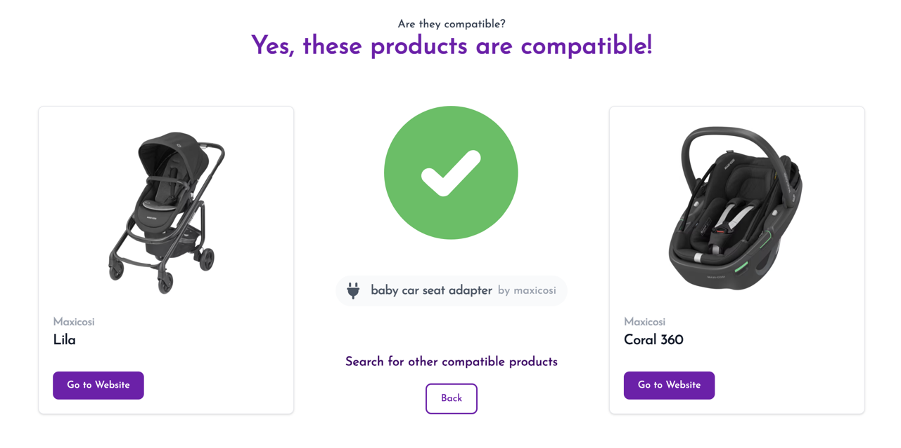

# Dev Log

## 09-08-2024

## Shipped
- [x] UI for adapters and compatibility
- [x] Admin import functionality for adapters and compatibility
- [x] Manual import of biggest easy data sources
- [x] (fix) production assets issue
- [x] (tech debt) CI for deployment on push
- [x] (tech debt) Added testing for complicated product import logic

## Carry over
- [ ] AI processing pipeline tooling

## Honeymoon is over

This week was slower than previous weeks. After the buzz of setting up the initial designs and getting the app up and running, I've come to the dirtier, harder part of the project; getting real data.

There aren't many snazzy new screenshots to share this week, and there were a couple of unexpected time sinks. 

Ultimately, I will have to make some decisions now about how to direct my energy next week - current methods aren't working.

#### Added the missing features of the UI 

There was still some UI work to do from the previous week. The app now has a nice UI element for showing adapters and compatibility, something that was missing before.

There are still lots missing from the UI (responsiveness, dark mode, the hideous image carousel) but this is enough for now. I'll return to this when more pressing issues have been resolved.

#### Lost two mornings to rails asset pipeline

I had neglected the production deployment in this early phase of development, and some stuff was broken in prod but working in dev. Specifically, the asset pipeline was not correctly loading my custom fonts.

I spent two (count em, two) mornings debugging the issue. This is mainly because the rails asset pipeline is complicated, and I needed to learn about it.

The TLDR is that, like most rails things, there's a convention that you need to know which is easy to miss. In this case it was the sprokets autoloading using the `url` method.

#### Real Data is messy

This is going to be the biggest challenge of the project.

Even within a single brand of products, the variety and complexity is staggering. Some products are no longer sold or advertised, some only sold in certain countries. Some come with their own adapters, others need their own adapter PLUS another one (third part or of the same brand). Information on compatibility is very sparse, sometimes contradictory, and often in a hard to parse format.

For the maxi-cosi brand, which provide a pdf chart of compatibility, I did the following.
- Tried some AI pdf processing tools, which didn't work.
- Manually copied the data into csv.
- Added admin endpoints for bulk uploading compatibility data via csv.

I also used an article containing compatiblity information on multiple brands. I did the following;
- Grabbed the html and ran it through a cleaner.
- threw that to chatgpt to extract some data.
This did the job mostly, but with some mistakes. I want to process smaller chunks in a reproducable way, so I looked into building some tooling.

#### AI processing tools

I worked on some tools to easily process files with GPT, going through multiple steps. I created `tools/openai-file-parser`, and the result is that you can define a pipeline, drop files into it and have it run through many steps.

My hope is that this will help me process lots of data without too much manual grunt work. When I can hook this up with image search and page search functions, this should be great for adding images and urls for specific products.

However, this is still wip and results remain to be seen.

#### Some cleanup

I took some time to do some refactoring work. The product import logic is complex so I added some testing, and started running tests in CI. This revealed some old routes which should have been removed, and gave me a nice chance to clean up the code a bit.

## Next time

- Need to decide on what to focus on; more data, or shipping. I think a nice number is something like 100 products; that's around when the site will be pretty useful. I'll try to get to 100 in the quickest and ugliest way, then look at scalability.
- Shipping stuff. Domain, logo, etc.