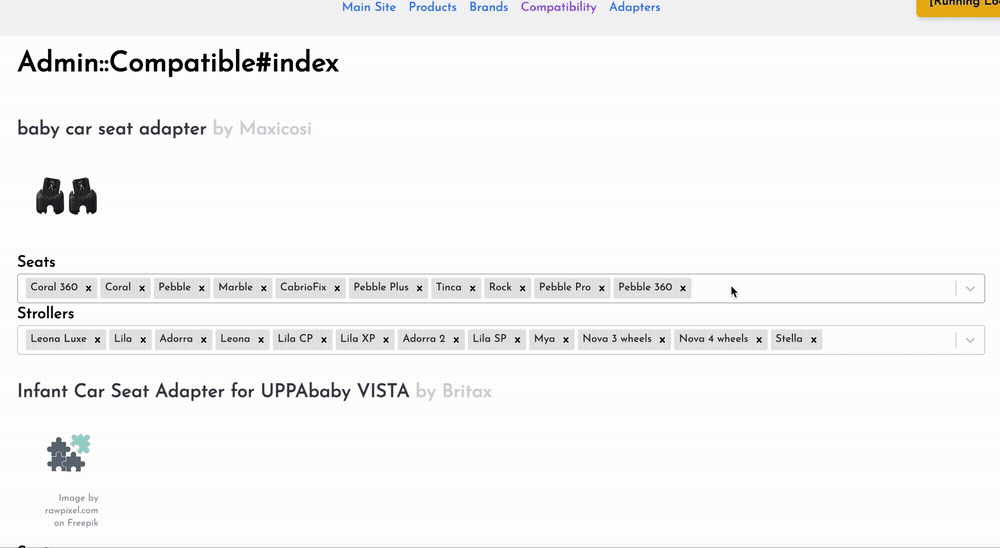

# Dev Log

## 23-08-2024

> **__NOTE:__** Due to life stuff, I ended up merging the last two weeks of progress into one update.

## Shipped
- [x] Hosted at domain www.fitmystroller.com
- [x] New product carousel
- [x] Improvements to admin product update flow
  - [x] Adapter compatability update page 
  - [x] Automatic product url generation
  - [x] Automatic product image generation
- [x] First tranche of product adapter data manually parsed and uploaded
- [x] (tech-debt) fixed some lingering n+1 queries
- [x] (tech-debt) added test coverage for core features

## Carry over
__nothing :)__

## Getting ready to ship

I had one objective for this delivery; get ready to ship.

This meant the following;
1. Get enough data populated to be minimally useful.
2. Need proper hosting on a domain.
3. Need some UI improvements - only for the most terrible parts.

### Life getting in the way

Family visits, moving house, living abroad, and a very needy 6-month-old all took precedence over the project the last two weeks. Managed to get a few things done anyway, but it certainly wasn't my top priority!

### Being a glorified data admin, except without the glorification

After my previous attempts to set up a data pipeline to populate the product and compatability data, I decided that I was putting the cart before the horse. My new plan is to enter the data manually for the first few hundred products, while building out the admin features so that I don't want to kill myself in the process.

That lead to some pretty tedious data gathering, as well as developing some fun features for the admin pages, such as;

- Multi-select and product search components for the admin compatability page. This means I can say "this adapter works for this stroller and that car seat" **much** faster.

- Automatically find the URL for the product from the brand website using the google search API.

- Automatically find a hotlink for the product image from the brand website using the google image search API.

### Shippidy ship ship 

So, with the admin upload process greatly streamlined, I went through the less fun process of scowering the brand websites for product information (which is surprisingly sparse, especially around the question of what works with what) and populating the db.

So with some useful product data, I did some other things to get this app ship-shape.

#### Get on the internet - I hear it's going to be huge.

We're now hosted on www.fitmystroller.com. I like the name and the domain was free, so it works for me until further notice!

Would be cool to get a logo and stuff sorted, but first things first.

#### New product carousel

The first product carousel was god awful, so I spent a bit of time making a better one.

This time it's responsive! (unlike the rest of the site, also on the todo list)

### Indulging some technical stuff

Although building this app is a goal in itself, there's also the sub goals of;
1. Learning ruby on rails
2. Showing off how I can build stuff with a new stack

With those in mind, there were a few glaring technical issues I couldn't let pass by, especially as part of my reasons for building this is to show off what a wonderful engineer I am. 

So, I look a bit of time to;

1. [Fix some n+1 query issues](https://github.com/LeweyM/stroller-compatibility/commit/d60f3467b9272459c488a70c36e493b40c528f88).
2. [Rework the model for adapters](https://github.com/LeweyM/stroller-compatibility/commit/58570476f2c1896fa171ed742de244034657b47c)
3. [Add a load of tests](https://github.com/search?q=repo%3ALeweyM%2Fstroller-compatibility+test%3A&type=commits)

## Next time

- Get someone, somewhere, to look at this.
- Set up affiliate marking links.
- Compatability without adapters might be necessary before shipping.
- The front page is not very pretty, might need some UI work, maybe a logo?